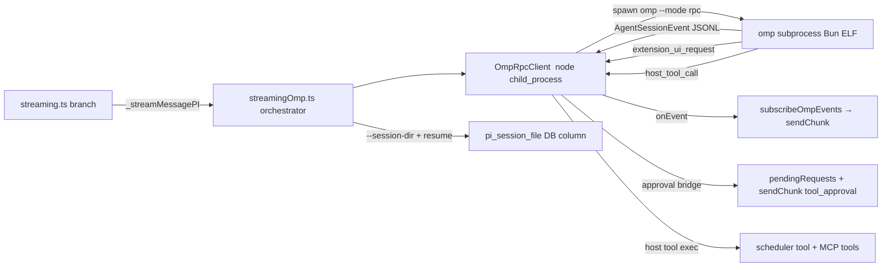

# Design: Replace the `pi` backend with Oh My Pi over RPC subprocess

**Date:** 2026-07-01
**Status:** Approved (user decisions recorded below)
**Scope:** Swap `ai_sdkBackend === 'pi'` from the in-process `@mariozechner/pi-coding-agent` SDK to **Oh My Pi** (`@oh-my-pi/pi-coding-agent`), driven out-of-process via `omp --mode rpc`.

## Decisions (from the user)

1. **Replace**, not add a third backend. `ai_sdkBackend === 'pi'` now means Oh My Pi. The backend id string stays `'pi'` (keeps the model-convention translation layer, `AuthGuard`, and settings keys stable — renaming is a wide mechanical blast radius for zero user benefit).
2. **Architecture:** out-of-process RPC subprocess. Non-negotiable — see "Why RPC" below.
3. **Shipping:** dev-first. Assume `omp` (and Bun) are installed and discoverable. Packaged-build sidecar bundling is deferred to a later phase (backlog).

## Why RPC (empirically established, not assumed)

The vendor SDK doc says "embed inside a Node or Bun process, no subprocess." That is **types-only** truth for the published artifact. Verified against `@oh-my-pi/pi-coding-agent@16.2.12`:

- `"main": "./src/index.ts"`, `exports["."].import → "./src/index.ts"` (raw TS); `dist/` ships only `.d.ts` + a Bun-compiled `cli.js`. No `node`/`require`/compiled-JS export condition.
- Source hard-imports Bun runtime built-ins with no Node equivalent: `import … from "bun"` (42 files: `$`, `YAML`, `TOML`, `Glob`, `spawn`, `FileSink`), `bun:sqlite` (39 files, the session/auth storage layer), `bun:ffi` (5), plus 700+ `Bun.*` global call sites.
- Runtime tests: `node --experimental-strip-types` refuses TS in `node_modules`; `tsx`/esbuild transpile fails `Cannot find package 'bun'`; the exact doc snippet runs clean under `bun`.

Electron's main process **is** Node (Electron bundles its own Node; the runtime can't be swapped to Bun), so in-process embedding is physically impossible in the desktop app. The `omp` binary is a **standalone compiled ELF** (embeds its own Bun runtime), so Node can `child_process.spawn('omp', ['--mode','rpc'])` directly — no `bun` needed on PATH for the binary itself.

**Empirical validation done:** Node spawned `omp --mode rpc`, received `{type:"ready"}`, `get_state` returned model `claude-opus-4-8` (authed via `~/.omp/agent`, 30 tools, session id), a real `prompt` produced the exact event stream `subscribeEvents.ts` consumes (`message_update`/`assistantMessageEvent.text_delta` → `"OK"`, `message_end`, `agent_end`), stdin-close → clean exit, empty stderr.

## The invariant contract (everything hinges on this)

`core/services/streaming.ts` branches at line ~314: `if (aiSettings?.sdkBackend === 'pi') return _streamMessagePI(messages, systemPrompt, aiSettings, conversationId)`, injected via `setPIBackend`. The new backend MUST honor the **exact** `StreamMessagePIFn` signature and return shape:

```ts
(messages, systemPrompt?, aiSettings?, conversationId?) =>
  Promise<{ content: string; toolCalls: ToolCall[]; aborted: boolean; sessionId: string | null; error?: string }>
```

…and stream via the existing `sendChunk(type, content?, extra?)`. If the new orchestrator honors this, **nothing else in `core` changes** — the three injection call sites (`main/services/streaming.ts`, `headless/index.ts`, `headless/taskRunner.ts`) just import the new function.

## Architecture



### Components

**New:**
- `src/core/services/pi/ompRpcClient.ts` *(already written)* — Node port of omp's `RpcClient`: spawn → ready → JSONL send/recv, request-id correlation, `onEvent`, `onExtensionUI`/`respondExtensionUI`, `setHostTools` + `host_tool_call`→`host_tool_result`/`host_tool_update`, `prompt`/`steer`/`abort`/`compact`/`getState`/`setModel`, `waitForAgentEnd`, `stop`. No Bun APIs.
- `src/core/services/pi/ompLocator.ts` — resolve the `omp` binary via `findBinaryInPath('omp')` (existing precedent for the `claude` CLI), with `PI_OMP_PATH` override; cache.
- `src/core/services/streamingOmp.ts` — the new orchestrator honoring `StreamMessagePIFn`. Owns per-turn: abort controller, host-tool assembly (scheduler + MCP), model/thinking flags, session-dir resume, event subscription, approval bridging, lifecycle.
- `src/core/services/pi/subscribeOmpEvents.ts` — event→StreamChunk mapper. **Ported nearly verbatim** from `subscribeEvents.ts` (event shapes are identical); input is `client.onEvent` frames instead of an in-process `session.subscribe`.
- `src/core/services/pi/ompHostTools.ts` — builds `OmpHostTool[]`: the scheduler tool (logic unchanged from `createSchedulerTool`) + one entry per MCP tool (reusing `mcpClient.ts` verbatim; rewrite `mcpToPiTools.ts` → `mcpToOmpHostTools.ts` producing the new 2-arg `execute(params, ctx)` shape).
- `src/core/services/pi/ompApprovalBridge.ts` — maps omp `extension_ui_request` (`confirm`/`select`/`input`) to the existing renderer approval flow (`sendChunk('tool_approval'|'ask_user')` + `pendingRequests` + `respondToApproval`), replying with `extension_ui_response`. This unifies the two old approval channels (canUseTool + parity permissionModes) into one.

**Reused as-is (backend-agnostic):**
- `mcpClient.ts` (pure MCP protocol, no pi-SDK dep).
- `canUseTool.ts`'s `pendingRequests`/`sendChunk`/`respondToApproval` seam (shared with the Claude path). The `createCanUseTool` state machine (AskUserQuestion normalization, deny-on-no-answer) is reused by the approval bridge where applicable.
- `modelBackendMap.ts`, `handlers/messages/modelResolver.ts` (keyed on the string `'pi'`, unchanged).
- `streaming.ts` `AISettings`, `sendChunk`, `abortControllers`, `denyPendingForConversation`, `setPIBackend` seam.

**Obsolete (delete):**
- `pi/sdkLoader.ts`, `pi/runSession.ts`, `pi/buildSessionConfig.ts`, `pi/buildCustomTools.ts`, `pi/setupMcp.ts`, `pi/buildPrompt.ts`, `pi/modelRegistry.ts`, `pi/resolveModel.ts`, `piPermissionGate.ts`, `mcpToPiTools.ts`, `piExtensionBridge.ts`, `piUIContext.ts`, `piUIRegistry.ts`, `streamingPI.ts`, and the whole `src/extensions/agent-desktop-parity/` package (in-process ExtensionFactory closures can't run in the subprocess).
- deps: `@mariozechner/pi-agent-core`, `@mariozechner/pi-ai`, `@mariozechner/pi-coding-agent`.
- `main/services/piExtensions.ts` (the `pi:uiResponse` IPC handlers for the in-process UI context).

## Key mappings

| Concern | Old (in-process @mariozechner) | New (omp RPC) |
|---|---|---|
| Built-in tools (read/bash/edit/write) | `piSdk.codingTools`, host-wrapped for CWD + approval | omp owns them natively in-subprocess; controlled via `--tools`/`--no-tools`, gated via omp approvals |
| Custom tools (scheduler, MCP) | `ToolDefinition[]` → `createAgentSession({customTools})` | `OmpHostTool[]` → `set_host_tools` + `host_tool_call` loop |
| Approvals | canUseTool wrap + parity permissionModes `ui.confirm` | `extension_ui_request` → approval bridge → renderer |
| permissionMode | parity extension modes | `--approval-mode` (default→write, bypassPermissions→yolo, plan→plan, acceptEdits→write, dontAsk→write + bridge cache) |
| Auth / API keys | `pi.AuthStorage.create()` in-process | omp reads `~/.omp/agent` itself; nothing injected |
| Model selection | `resolvePIModelObject` → `Model<any>` object | `--model <id>` fuzzy/`provider/id`, or `set_model` |
| Thinking level | `mapThinkingLevel(maxThinkingTokens)` → 'off'/'low'/'medium'/'high' | same mapping → `--thinking` flag / `set_thinking_level` |
| Session resume | `pi_session_file` → `SessionManager.open(file)` | keep `pi_session_file` column; `--session-dir` + `-r <file>`/`--continue`; capture path from `get_state.sessionFile` |
| CWD restriction | `applyCwdRestriction` wraps each tool | **Parity gap** — omp built-ins aren't host-interceptable. Use `--cwd` + omp approval prompts for out-of-cwd writes; full whitelist enforcement → backlog |

## Session identity decision

**Keep `pi_session_file`** (path semantics), not a new column. omp persists sessions as JSONL under `~/.omp/agent/sessions/…` (validated). Orchestrator: pass `--session-dir` (or default), after `ready` call `get_state` to capture `sessionFile`, persist via existing `setConversationPiSessionFile`. On resume, pass the stored file via `-r`. This keeps schema/migrations/`messages.ts` getter-setter and all 5 invalidation sites + their tests unchanged.

## summarization.ts

`summarizePI` (in-memory, zero tools, direct `createAgentSession`) → rewrite as a **one-shot omp RPC** helper: spawn `omp --mode rpc --no-tools --no-session --model <id>`, single `prompt`, collect `text_delta`, `stop`. Small dedicated path; does not go through the main orchestrator.

## Parity gaps → backlog (explicitly NOT silently dropped)

- Full CWD whitelist enforcement on omp's native built-in tools (omp lacks a host-side per-tool interception seam; only approval prompts + `--cwd`).
- `hooksSystem` (parity extension bridging PI events → Claude config-file hooks). omp has its own hooks/extensions format; re-authoring as an omp-native extension is out of dev-first scope.
- `budgetTracker`, `skillsBridge` parity modules.
- Packaged-build Bun/omp sidecar bundling (dev-first defers this).

These will be written to deez-notes as the project backlog.

## Verification plan

1. Live smoke: `streamMessageOmp` end-to-end (prompt → text stream → tool call → approval → done) against real `omp`.
2. New unit tests (delegated to Tester): `ompRpcClient` (framing, correlation, host-tool loop, abort), `subscribeOmpEvents` (event→chunk parity), approval bridge.
3. Rewrite/rewire the 26 mapped test files: delete the 14 in-process-PI-specific ones, re-point the ~12 backend-agnostic ones (mock target → new orchestrator).
4. Run main + renderer suites.
